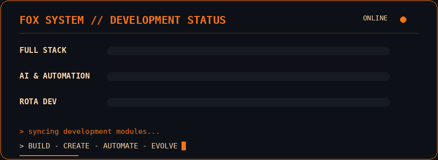

<div align="center">


</div>

## `01 // FOX_IDENTITY`

```typescript
const lilian = {
  role: "Full Stack Developer",
  stack: ["React", "TypeScript", ".NET", "C#"],
  studying: "AI & Automation",
  building: "Rota Dev",
  focus: ["Web Development", "APIs", "Automation", "AI"],
  mindset: "Code. Create. Automate. Evolve."
};
```

## `02 // FOX_STACK`

<div align="center">


<br/>


<br/><br/>


<br/>


<br/><br/>


<br/>


<br/><br/>

<code>FOX SYSTEM &gt; ALL MODULES LOADED ✓</code>

</div>


</div>

## `03 // FOX_TERMINAL`

```bash
> booting fox system...

[ OK ] Developer profile loaded
[ OK ] Front-end modules loaded
[ OK ] Back-end modules loaded
[ OK ] AI & Automation module loaded

ROLE        : Full Stack Developer
STACK       : React | TypeScript | .NET | C#
BUILDING    : Rota Dev
STUDYING    : AI & Automation
MODE        : Focused
STATUS      : ONLINE

> awaiting next challenge... █
```
## `04 // ROTA_DEV`

<div align="center">


<br/><br/>

<h3>🦊 Rota Dev</h3>

<p>
Projeto voltado ao universo de desenvolvimento e tecnologia,<br/>
construído com uma stack moderna e integração com serviços reais.
</p>

<br/>


<br/>


<br/>


<br/><br/>

<a href="https://github.com/LilianMilan/rota-dev">
  
</a>

<br/><br/>

<code>PROJECT STATUS &gt; ACTIVE DEVELOPMENT ✓</code>

</div>

## `05 // PROJECT_ARCHIVE`

<div align="center">


<br/><br/>

<p>
Projetos que fizeram parte da minha evolução no desenvolvimento de software.
</p>

<br/>

<a href="https://github.com/LilianMilan/TasksApp">
  
</a>

<a href="https://github.com/LilianMilan/conceitosReact-AppAcademy">
  
</a>

<a href="https://github.com/LilianMilan/Simulador">
  
</a>

<br/><br/>

<code>ARCHIVE STATUS &gt; PART OF THE JOURNEY ✓</code>

</div>

## `06 // SYSTEM_METRICS`

<div align="center">



</div>

## `07 // CONTRIBUTION_MATRIX`

<div align="center">


<br/><br/>


<br/><br/>

<code>CONTRIBUTION MATRIX &gt; ACTIVE DEVELOPMENT MODE ✓</code>

</div>
